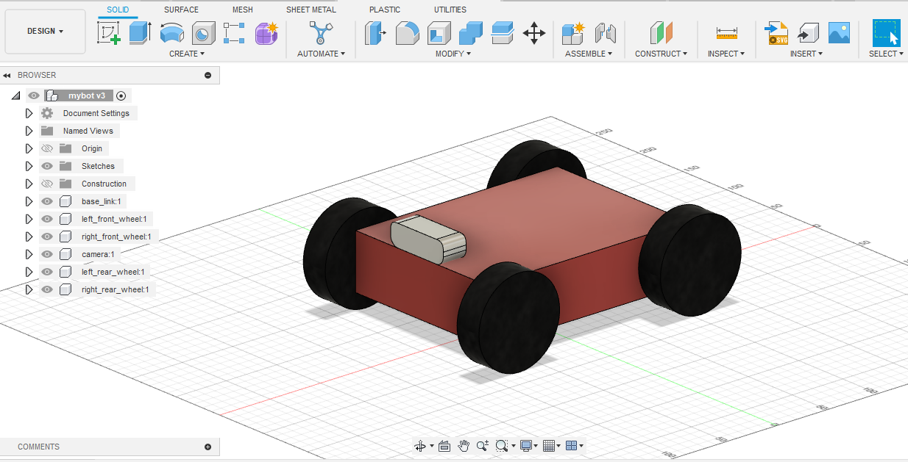
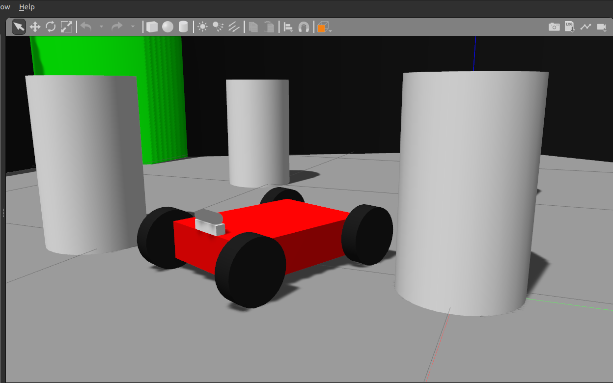
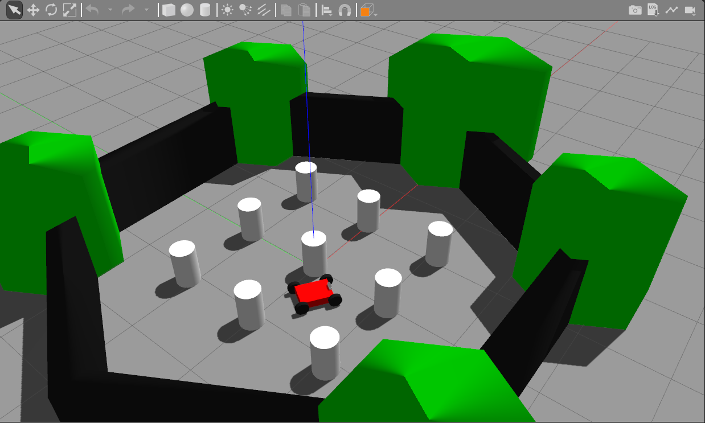

## 3D Visual Navigation with a Mobile Robot and RGBD Camera (using RTAB-Map SLAM / Octomap)

**In this project, I did the following:** 
- Designed a mobile robot with an RGBD camera and 2D Lidar (not shown below) in Fusion 360.
- Converted the CAD design into a URDF and imported it in Gazebo.
- Connected RGBD Camera and 2D Lidar ROS packages to the respective URDF components.
- Tested RTAB-Map SLAM in the TurtleBot World environment in Gazebo.

    

